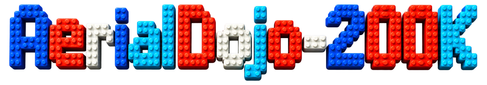

<p align="left">
  <a href="https://arxiv.org/abs/2609.36066"></a>
  <a href="https://fengtt42.github.io/AerialDojo/"></a>
  <a href="https://huggingface.co/datasets/fengtt42/AerialDojo-200K/tree/main/AerialENVS"></a>
  <a href="https://huggingface.co/datasets/fengtt42/AerialDojo-200K/tree/main/SemanticOGS"></a>
  <a href="https://huggingface.co/datasets/fengtt42/AerialDojo-200K/tree/main/ImageOGS"></a>
  <a href="https://huggingface.co/datasets/fengtt42/AerialDojo-200K/tree/main/TrajectoryDATA"></a>
  <a href="https://github.com/fengtt42/AerialDojo-200K"></a>
  <a href="https://github.com/fengtt42/AerialDojo"></a>
</p>

<p align="center">
  
</p>

**AerialDojo-200K** is a large-scale benchmark suite for **open-world aerial object-goal search (AerialOGS)**. This is the official repository for the [AerialDojo-200K paper](https://arxiv.org/abs/2609.36066), providing code and documentation for its simulation environments, search tasks, reference trajectories, recording tools, and evaluation framework. If you find this work useful, please give us a star ⭐. Thank you!

<p align="center">
  <a href="https://fengtt42.github.io/AerialDojo/assets/fig1.webp"></a>
</p>

<table width="100%">
  <tr>
    <td width="170" valign="top"><strong>01<br />Large-Scale</strong></td>
    <td>AerialDojo-200K comprises <strong>42 scenes</strong> across four scene families and 21 scene types, and <strong>205,732 task instances</strong> spanning SemanticOGS and ImageOGS under Base, Standard, and Long-Horizon settings. AerialDojo-200K offers <strong>3× as many scenes and 18.7× as many task instances</strong> as the largest prior benchmark for aerial object-goal search.</td>
  </tr>
</table>

<table width="100%">
  <tr>
    <td width="170" valign="top"><strong>02<br />High-Quality</strong></td>
    <td>AerialDojo-200K provides extensive manual annotations of 109 landmarks, 2,099 objects, and 2,099 object anchors, <strong>completed by 12 annotators over two months.</strong> AerialDojo-200K includes collision-free reference trajectories totaling 4,115.313 km of unique routes and 63,177 groups of multi-view recordings, recorded exclusively for training.</td>
  </tr>
</table>

<table width="100%">
  <tr>
    <td width="170" valign="top"><strong>03<br />Unified Evaluation</strong></td>
    <td>AerialDojo-200K <strong>unifies data formats, action spaces, and evaluation protocols</strong>, with 21 in-distribution and 21 out-of-distribution scenes. AerialDojo-200K evaluates <strong>nine multimodal large language models</strong>, revealing that existing methods still have a long way to go towards general-purpose aerial agents.</td>
  </tr>
</table>

## 1. Directory layout

```text
AerialDojo-200K/
├── README.md
├── AerialENVS/                  # Packaged UE / ProjectAirSim environments
│   ├── ID_ENVS/
│   └── OOD_ENVS/
├── SemanticOGS/                 # Semantic-goal search task instances
├── ImageOGS/                    # Image-goal search instances and reference images
├── TrajectoryDATA/              # Reference trajectories shared by paired instances
├── VideoRECORD/                 # Recorded RGB, depth, poses, and actions
├── BENCHMARK/                   # Benchmark directory
└── AerialDojo/                  # Code, configurations, and launch scripts
```

Place the environment, task, and trajectory data in the corresponding directories above.
Each SemanticOGS instance is paired with an ImageOGS instance that shares its scene,
start pose, target object, and reference trajectory, but uses a different goal
representation. The two representations are evaluated as separate search task instances.

## 2. Using AerialDojo

Code is in `AerialDojo/`: `config/` holds configurations, `scripts/` holds launch scripts,
and the inner `AerialDojo/` Python package contains the environment, policy factory,
scene service, and recorder.

### 2.1 Installation

Run on a Linux GPU server. From the repository root:

```bash
cd AerialDojo
conda create -n aerialdojo python=3.10
conda activate aerialdojo
python -m pip install -r requirements.txt

python -m pip install -e /path/to/ProjectAirSim/client/python/projectairsim
```

Replace the ProjectAirSim source path with the client matching your environment plugin.
Run subsequent commands from this code directory, using the same Python environment
in each terminal.


### 2.2 Trajectory recording

Set `dataset_root` and `gpus` in
[config/record_jobs.yaml](AerialDojo/config/record_jobs.yaml). The default dataset root
is the parent directory, `..`, with environments under `AerialENVS/` and output under
`VideoRECORD/`. The recording service uses RPC port 36000 and scene ports starting at 36100.

Start the recording server in terminal 1:

```bash
bash scripts/record_server.sh
```

Inspect task assignments, then record one complete trajectory in terminal 2:

```bash
bash scripts/record.sh --map_name N_Island_0 --tasks base --limit 1 --dry_run
bash scripts/record.sh --map_name N_Island_0 --tasks base --limit 1
```

By default, the recorder selects base, standard, and long tasks from the training splits.
Use `bash scripts/record.sh --map_name N_Island_0` to record all selected tasks for a map.

| Argument | Purpose |
| --- | --- |
| `--map_name` | Select a map |
| `--splits` | ID_TRAINS, ID_TESTS, OOD_TRAINS, or OOD_TESTS |
| `--tasks` | base, standard, or long |
| `--episode_ids 0 5 12` | Select partition-local IDs together with a split and task category |
| `--limit` | Maximum selected tasks; 0 means unlimited, applied before resume scanning |
| `--max_steps` | Maximum captured frames per trajectory; 0 records the full route |
| `--gpus` | GPU list, with one scene per GPU |
| `--dataset_root` / `--output_root` | Override the dataset root / output directory |
| `--dry_run` | Show task assignments without launching UE |
| `--overwrite` | Rerecord selected tasks; resume is the default |

Use the same GPU pool for the service and recorder:

```bash
# Terminal 1
bash scripts/record_server.sh --gpus 2,4
# Terminal 2
bash scripts/record.sh --map_name N_Island_0 --gpus 2 4
```

**Output and resume.** The default output is
`../VideoRECORD/<split>/<task>/<map>_<B|S|L>/<episode_id>/`, containing front, left, right,
and down 640×640 RGB PNGs, float32 depth NPYs in meters, and per-frame poses, actions,
and task metadata. Recording uses non-physics pose playback with collisions disabled.
Change camera resolution in the capture-settings of the
[robot configuration](AerialDojo/config/sim_config/robot_aerialdojo_quadrotor_nonphysics.jsonc).

Rerun the same command to resume; completed tasks are skipped. Frames are staged in
`/tmp/aerialdojo_record_stage` before being copied to the output directory. Use
`--local_stage_root ''` to write directly to the destination. After recording processes
have stopped, rebuild the global index if needed:

```bash
python -m AerialDojo.trajectory_recording.rebuild_collected_index \
  --record-root ../VideoRECORD
```

### 2.3 Online policy evaluation

| Setting | Reference trajectory length | Action budget |
| --- | --- | --- |
| Base | 5 m ≤ length < 30 m | 90 |
| Standard | 30 m ≤ length < 60 m | 180 |
| Long-Horizon | 60 m ≤ length < 100 m | 300 |

The primary success criterion is an explicit **Stop within 3 m of the target anchor**, without collision and within the action budget. Episodes end on Stop, collision, or budget exhaustion. The paper reports SR, OSR, DTS, SPL, and CR; 5 m is a supplementary success threshold. See the [paper](https://arxiv.org/abs/2609.36066) for the complete protocol and the [project website](https://fengtt42.github.io/AerialDojo/) for results.

The `trajectory` policy replays a supplied reference trajectory for testing the pipeline;
it is not an autonomous object-goal search baseline. For benchmark results, use a search
policy and the setting-specific action budget in the table above.

Set `server.root_path` to your local AerialENVS directory and select `gpus` in
[config/server_config.yaml](AerialDojo/config/server_config.yaml). The default RPC port
is 36000, with scene ports starting at 36100. `show_game: false` enables offscreen rendering.

Configure [config/policy_config.yaml](AerialDojo/config/policy_config.yaml):

| Setting | Purpose |
| --- | --- |
| `task_file` | Local task JSON path |
| `policy` | trajectory, cliph, or a custom policy |
| `policy_config` | Policy constructor arguments; trajectory uses trajectory_file |
| `gpu_id` | GPU used by the UE scene |
| `episodes` | Number of tasks; 0 runs all tasks in the file |
| `max_actions` | Per-task action limit, 300 by default |
| `output` | Evaluation JSONL path |

**Input format.** Online tasks are a JSON array, with `start_pose.start_position` and
`start_pose.start_quaternionr` for the start and `goal_pose.goal_position` for the goal.
Published tasks use `start_quaternion_xyzw`; provide the same values as
`start_quaternionr` when loading, keeping xyzw order. Set task_file and trajectory_file
to your actual local files.

The trajectory policy reads JSONL, with `trajectory_id` and `actions` in each row.
Set the same `trajectory_id` in the task. To convert a published trajectory, locate its
JSON by partition and episode_id, remove the initial start, keep subsequent actions,
and append stop. Optional internal steps use `position_m` and `quaternion_wxyz`.

Start the online server in terminal 1:

```bash
bash scripts/server.sh
```

Run one episode in terminal 2:

```bash
bash scripts/run_policy.sh --config config/policy_config.yaml --episodes 1
```

CLIP-H uses description, four current camera images, and depth. Set task_file, gpu_id,
and model parameters in its separate configuration, then run:

```bash
bash scripts/run_policy.sh --config config/policy_config_cliph.yaml --episodes 1
```

Each evaluation row reports success, collision, oracle_success, steps, termination
reason, distances, and reward. Reusing the output path overwrites the previous evaluation.

### 2.4 Integrate your own policy

Import `NavigationPolicy`, `PolicyAction`, and `PolicyFactory` from `AerialDojo.policies`.
Subclass `NavigationPolicy`, initialize episode state in `reset(observation)`, and
return a `PolicyAction` enum from `forward(observation)`.

`NavigationPolicy` is the existing Python interface name; the benchmark task is
open-world aerial object-goal search.

The factory resolves the policy class and constructs an instance in either of two ways:

- **Load the class directly:** set `--policy my_package.my_policy:MyPolicy` and make the module importable.
- **Load by registered name:** decorate the class with `@PolicyFactory.register("my_policy")`,
  then use `--policy-module my_package.my_policy --policy my_policy` to import it before construction.

Parameters from `policy_config` or `--policy-config` are passed to the constructor.
For a no-argument policy, replace the old configuration with `--policy-config '{}'`.
Your own program can call `PolicyFactory.create("my_policy", **config)` and inspect
registered names with `PolicyFactory.available()`.

### 2.5 Environment interface, observations, and actions

For an existing control or training loop, construct `SimpleUAVEnv` with task_file or
tasks, then call reset, step, and close. Reset starts or reuses a UE scene.

| Method | Return values or purpose |
| --- | --- |
| `reset(indices=...)` | Initial observation list |
| `step(actions)` | observations, rewards, dones, infos |
| `step_gymnasium(actions)` | observations, rewards, terminated, truncated, infos |
| `observe(include_images=False)` | Read state without capturing images |
| `close()` | Clean up connections and scenes managed by the environment |

Return values are batch lists, including when batch_size=1; the action-list length must
match the current batch. To use the online evaluator's stopping rule, set
`UAVEnvConfig.terminate_on_success=False` and let the policy issue Stop.

| Observation field | Contents |
| --- | --- |
| `rgb` / `depth` | Front, left, right, down PNG bytes / float32 depth arrays in meters |
| `pose` | NED position and xyzw quaternion, seven values |
| `task` | Current task and normalized fields |
| `state` / `imu` | State and IMU information |
| `trajectory` | Pose, action, and distance history |
| `step` / `move_distance` / `distance_to_goal` | Steps, traveled distance, and goal distance |
| `done` / `success` / `collision` / `oracle_success` | Episode state |
| `terminated` / `truncated` / `termination_reason` | Termination, truncation, and reason |

These are raw environment fields, not the benchmark agent's allowed inputs. Search
policies must follow the paper's visual-observation protocol: do not expose simulator
ground truth, target coordinates, goal distances, or reference trajectories to the agent.

| PolicyAction | Environment action | Default behavior |
| --- | --- | --- |
| MoveForward / MoveLeft / MoveRight | forward / left / right | Move 1 meter relative to heading |
| MoveUp / MoveDown | ascend / descend | Move up / down 1 meter |
| TurnLeft / TurnRight | rotl / rotr | Turn left / right 15 degrees |
| Stop | stop | Stop explicitly |

Policies return enums; direct env.step calls use a list of action strings. When importing
from another project, add the code directory to PYTHONPATH and supply the actual task
and configuration paths.

## 3. Task–trajectory correspondence

The three data directories share the same partition layout:

```text
<split>/<task category>/<map>_<B|S|L>_<Train|Test>/
```

**Within each partition, episode IDs run independently from `0` to `N-1`. A SemanticOGS
task, its ImageOGS counterpart, and its trajectory correspond one-to-one:**

| Data | Record or file for episode `n` |
| --- | --- |
| SemanticOGS | Record with `episode_id = "n"` in that partition's `Task.json` |
| ImageOGS | Record with `episode_id = "n"` in the same partition's `Task.json` |
| TrajectoryDATA | `<same partition>/n.json` |

Use the full partition path plus `episode_id` to identify a task globally. The
trajectory's internal `task_id` is its planning identifier; published trajectory
filenames follow `episode_id`. Resolve an ImageOGS task's `image` path relative to the
directory containing its `Task.json`.

Task and trajectory positions use NED meters; quaternions use `[x, y, z, w]` order.

## Citation

If you use AerialDojo-200K in your research, please cite:

```bibtex
@article{feng2026aerialdojo,
  title={AerialDojo-200K: A Large-Scale Benchmark Suite for Open-World Aerial Object-Goal Search},
  author={Feng, Tongtong and Wang, Xin and Hou, Haoran and Wang, Ren and Wang, Weiran and Zhu, Shaokai and Jia, Ziqi and Wang, Hao and Zhan, Yu-Wei and Wu, Zongyuan and Cui, Jinghao and Zhu, Wenwu},
  journal={arXiv preprint arXiv:2609.36066},
  year={2026}
}
```
