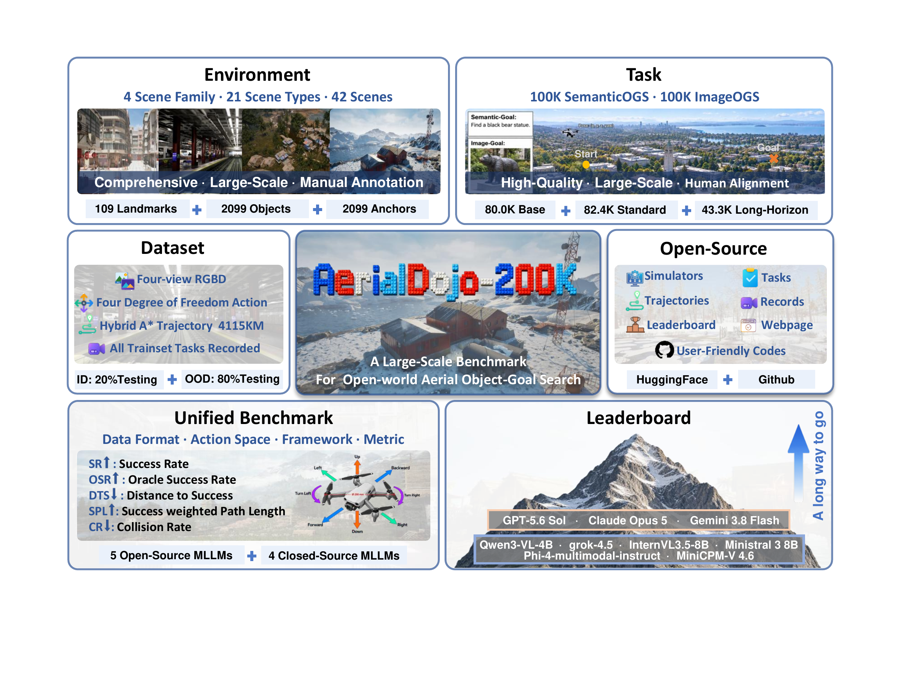

# AerialDojo-200K

[English](README.md) | 简体中文

[](AerialDojo/assets/figures/fig1.png)

AerialDojo-200K 提供面向无人机目标搜索的环境、导航任务、轨迹和运行工具。

当前 GitHub 仓库包含代码、文档和数据目录占位文件。数据将另行发布到
Hugging Face，下载链接会补充在本页。

## 1. 总体目录

```text
AerialDojo/
├── README.md
├── AerialENVS/                  # UE / ProjectAirSim 打包地图
│   ├── IID_ENVS/
│   └── OOD_ENVS/
├── SemanticOGS/                 # 文本目标导航任务
├── ImageOGS/                    # 图片目标任务及参考图片
├── TrajectoryDATA/              # 与任务一一对应的规划轨迹
├── VideoRECORD/                 # 录制的 RGB、深度、位姿和动作
├── BENCHMARK/                   # 基准测试目录
└── AerialDojo/                  # 代码、配置和启动脚本
```

将地图、任务和轨迹数据放入上述对应目录。SemanticOGS 与 ImageOGS 是同一批
导航任务的两种目标表示。

## 2. AerialDojo 使用说明

代码位于 `AerialDojo/`：`config/` 存放配置，`scripts/` 存放启动脚本，
内部 `AerialDojo/` 是 Python 包，包含环境、策略工厂、地图服务和录制模块。

### 2.1 安装环境

在 Linux GPU 服务器上运行，从仓库根目录执行：

```bash
cd AerialDojo
conda create -n aerialdojo python=3.10
conda activate aerialdojo
python -m pip install -r requirements.txt

python -m pip install -e /path/to/ProjectAirSim/client/python/projectairsim
```

将 ProjectAirSim 源码路径替换为与地图插件匹配的客户端位置。后续命令均在
这个代码目录中执行，各终端使用相同的 Python 环境。


### 2.2 轨迹录制

修改 [config/record_jobs.yaml](AerialDojo/config/record_jobs.yaml)：设置
`dataset_root` 和 `gpus`。默认数据根目录为上一级 `..`，地图位于其下的
`AerialENVS/`，结果写入 `VideoRECORD/`。录制服务默认 RPC 端口为 36000，
场景端口从 36100 开始分配。

终端 1 启动录制服务：

```bash
bash scripts/record_server.sh
```

终端 2 检查任务分配，再录制一条完整轨迹：

```bash
bash scripts/record.sh --map_name N_Island_0 --tasks base --limit 1 --dry_run
bash scripts/record.sh --map_name N_Island_0 --tasks base --limit 1
```

默认选择训练集的 base、standard、long 任务。录制整张地图使用
`bash scripts/record.sh --map_name N_Island_0`。

| 参数 | 用途 |
| --- | --- |
| `--map_name` | 选择地图 |
| `--splits` | IID_TRAINS、IID_TESTS、OOD_TRAINS 或 OOD_TESTS |
| `--tasks` | base、standard 或 long |
| `--episode_ids 0 5 12` | 选择分区内编号，配合 split 和 task 使用 |
| `--limit` | 最多选择的任务数；0 为不限，在续录扫描前应用 |
| `--max_steps` | 每条轨迹最多采集的帧数；0 为完整录制 |
| `--gpus` | GPU 列表，每张 GPU 一个场景 |
| `--dataset_root` / `--output_root` | 覆盖数据根目录 / 输出目录 |
| `--dry_run` | 显示任务分配，不启动 UE |
| `--overwrite` | 重录选中的任务；默认断点续录 |

多 GPU 时，服务与录制进程使用相同的 GPU 池：

```bash
# 终端 1
bash scripts/record_server.sh --gpus 2,4
# 终端 2
bash scripts/record.sh --map_name N_Island_0 --gpus 2 4
```

**输出与续录。** 默认输出到
`../VideoRECORD/<split>/<task>/<map>_<B|S|L>/<episode_id>/`，包含前、左、右、下
四路 640×640 RGB PNG、米制 float32 深度 NPY，以及逐帧位姿、动作和任务元数据。
录制使用无碰撞的非物理位姿回放；相机分辨率在
[机器人配置](AerialDojo/config/sim_config/robot_aerialdojo_quadrotor_nonphysics.jsonc)
的 capture-settings 中修改。

重新执行相同命令即可续录，完成的任务会跳过。默认先写入
`/tmp/aerialdojo_record_stage` 再提交到输出目录；`--local_stage_root ''` 可直接
写入最终目录。录制进程停止后，可重建全局索引：

```bash
python -m AerialDojo.trajectory_recording.rebuild_collected_index \
  --record-root ../VideoRECORD
```

### 2.3 在线策略评测

在 [config/server_config.yaml](AerialDojo/config/server_config.yaml) 中设置
`server.root_path` 为本机 `AerialENVS` 的实际路径，并设置 `gpus`。
默认 RPC 端口为 36000，场景端口从 36100 开始；`show_game: false` 使用后台渲染。

在 [config/policy_config.yaml](AerialDojo/config/policy_config.yaml) 中配置：

| 配置项 | 用途 |
| --- | --- |
| `task_file` | 本机任务 JSON 文件路径 |
| `policy` | trajectory、cliph 或自定义策略 |
| `policy_config` | 传给策略构造函数的参数；trajectory 使用 trajectory_file |
| `gpu_id` | UE 场景使用的 GPU |
| `episodes` | 运行任务数；0 为该文件全部任务 |
| `max_actions` | 每个任务的动作上限，默认 300 |
| `output` | 评测结果 JSONL 路径 |

**输入格式。** 在线任务为 JSON 数组，起点使用 `start_pose.start_position` 和
`start_pose.start_quaternionr`，目标使用 `goal_pose.goal_position`。公开任务的
四元数字段为 `start_quaternion_xyzw`，加载时提供同值的 `start_quaternionr`，
顺序仍为 xyzw。将配置中的 task_file 和 trajectory_file 改为本机实际文件路径。

trajectory 策略读取 JSONL，每行包含 `trajectory_id` 和 `actions`，任务中设置
相同的 `trajectory_id`。从公开轨迹转换时，按分区和 episode_id 找到原 JSON，
去掉首项 start，保留后续动作并在末尾补 stop。如提供内部 steps，字段使用
`position_m` 和 `quaternion_wxyz`。

终端 1 启动在线服务：

```bash
bash scripts/server.sh
```

终端 2 运行一个任务：

```bash
bash scripts/run_policy.sh --config config/policy_config.yaml --episodes 1
```

CLIP-H 使用 `description`、实时四路图像和深度。设置其独立配置中的 task_file、
gpu_id 与模型参数后运行：

```bash
bash scripts/run_policy.sh --config config/policy_config_cliph.yaml --episodes 1
```

评测结果每个任务一行，包含成功、碰撞、oracle_success、步数、终止原因、距离
和奖励。相同 output 路径会覆盖上次的评测文件。

### 2.4 接入自己的策略

从 `AerialDojo.policies` 导入 `NavigationPolicy`、`PolicyAction` 和
`PolicyFactory`。策略继承 `NavigationPolicy`，用 `reset(observation)` 初始化
回合状态，在 `forward(observation)` 中返回 `PolicyAction` 枚举。

工厂负责找到策略类并创建实例，有两种加载方式：

- **直接加载类**：设置 `--policy my_package.my_policy:MyPolicy`，保证模块可被导入。
- **按注册名加载**：使用 `@PolicyFactory.register("my_policy")` 注册类，运行时设置
  `--policy-module my_package.my_policy --policy my_policy`，先导入模块再创建策略。

`policy_config` 或 `--policy-config` 中的参数传给构造函数。不需要参数时用
`--policy-config '{}'` 替换原配置。自己的程序也可调用
`PolicyFactory.create("my_policy", **参数字典)`，用 `PolicyFactory.available()`
查看注册名。

### 2.5 环境接口、观测与动作

已有控制或训练循环时，创建 `SimpleUAVEnv` 并提供 task_file 或 tasks，再调用
reset、step、close。reset 时启动或复用 UE 场景。

| 接口 | 返回值或作用 |
| --- | --- |
| `reset(indices=...)` | 初始观测列表 |
| `step(actions)` | observations、rewards、dones、infos |
| `step_gymnasium(actions)` | observations、rewards、terminated、truncated、infos |
| `observe(include_images=False)` | 读取状态，不采图 |
| `close()` | 清理连接和环境管理的场景 |

返回值按 batch 组织为列表，batch_size=1 时也一样；动作列表长度与当前 batch
一致。与在线评测保持相同的停止规则时，设置
`UAVEnvConfig.terminate_on_success=False`，由策略主动 Stop。

| observation 字段 | 内容 |
| --- | --- |
| `rgb` / `depth` | 前、左、右、下四路 PNG bytes / float32 米制深度数组 |
| `pose` | NED 位置与 xyzw 四元数，共 7 个数 |
| `task` | 当前任务与归一化字段 |
| `state` / `imu` | 状态与 IMU 信息 |
| `trajectory` | 历史位姿、动作与距离 |
| `step` / `move_distance` / `distance_to_goal` | 步数、累计移动距离与目标距离 |
| `done` / `success` / `collision` / `oracle_success` | 回合状态 |
| `terminated` / `truncated` / `termination_reason` | 终止、截断与原因 |

| PolicyAction | 环境动作 | 默认行为 |
| --- | --- | --- |
| MoveForward / MoveLeft / MoveRight | forward / left / right | 相对当前朝向移动 1 米 |
| MoveUp / MoveDown | ascend / descend | 上升 / 下降 1 米 |
| TurnLeft / TurnRight | rotl / rotr | 左转 / 右转 15° |
| Stop | stop | 主动停止 |

策略返回枚举；直接使用 env.step 时传入动作字符串列表。在其他项目中导入时，
将代码目录加入 PYTHONPATH，并提供任务和配置的实际路径。

## 3. 任务与轨迹的对应关系

三个数据目录使用相同的分区结构：

```text
<数据划分>/<任务类型>/<地图>_<B|S|L>_<Train|Test>/
```

**每个分区独立从 `0` 到 `N-1` 编号。同一分区内，语义任务、图片任务和轨迹
按 episode 一一对应：**

| 数据 | episode `n` 对应的记录或文件 |
| --- | --- |
| SemanticOGS | 当前分区 `Task.json` 中 `episode_id = "n"` 的任务 |
| ImageOGS | 相同分区 `Task.json` 中 `episode_id = "n"` 的任务 |
| TrajectoryDATA | `<相同分区>/n.json` |

全局定位任务时使用完整分区路径加 `episode_id`。轨迹内部的 `task_id` 是规划
阶段编号，公开轨迹文件名以 `episode_id` 为准。ImageOGS 的 `image` 字段相对于
该任务的 `Task.json` 所在目录解析。

任务和轨迹的位置使用 NED 米制坐标，四元数顺序为 `[x, y, z, w]`。
